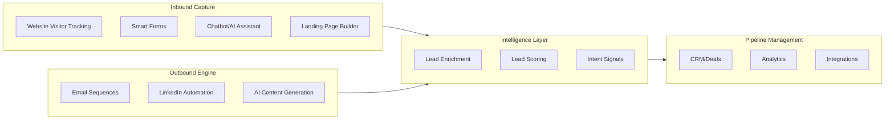
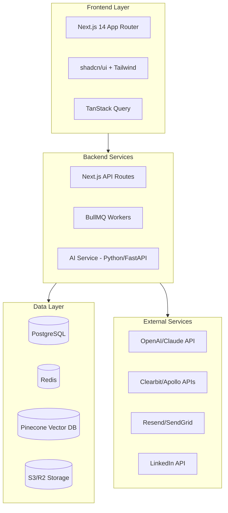

# lead_gen
---
name: Enhanced LeadGen Platform
overview: Build a next-generation AI-powered lead generation platform that combines inbound capture (chatbots, landing pages, visitor tracking), outbound automation (multi-channel sequences, AI SDR agents), intelligent data enrichment with intent signals, and predictive analytics - designed for internal agency use with SaaS scalability.
todos:
  - id: setup-project-v2
    content: Initialize Next.js 15 with App Router, TypeScript, Prisma, configure Clerk auth with multi-tenant support
    status: pending
  - id: database-schema-v2
    content: "Design comprehensive schema: leads, companies, contacts, deals, sequences, emails, activities, analytics events, enrichment data"
    status: pending
  - id: core-crm-v2
    content: "Build CRM: lead/company views, pipeline kanban, unified activity timeline, search/filters, bulk actions"
    status: pending
  - id: email-foundation
    content: Set up Resend integration, email composer with MJML templates, basic send/track functionality, domain verification
    status: pending
  - id: sequence-builder
    content: Build visual email sequence editor with steps, delays, conditions, A/B variants, and scheduling
    status: pending
    dependencies:
      - email-foundation
  - id: ai-email-gen
    content: Integrate OpenAI for personalized email generation using lead/company context, implement prompt engineering
    status: pending
    dependencies:
      - sequence-builder
  - id: enrichment-pipeline
    content: Build data enrichment service integrating Clearbit, Apollo, Hunter APIs with caching and fallbacks
    status: pending
    dependencies:
      - database-schema-v2
  - id: lead-scoring
    content: "Implement hybrid scoring engine: configurable rules + ML model (Python FastAPI service)"
    status: pending
    dependencies:
      - enrichment-pipeline
  - id: visitor-tracking
    content: Add website visitor tracking via pixel/script, IP-to-company identification, intent signal collection
    status: pending
    dependencies:
      - core-crm-v2
  - id: chatbot-ai
    content: Build LLM-powered chatbot for lead qualification, FAQ handling, and meeting booking
    status: pending
    dependencies:
      - ai-email-gen
  - id: landing-builder
    content: Create drag-and-drop landing page builder with templates, form integration, and A/B testing
    status: pending
    dependencies:
      - visitor-tracking
  - id: linkedin-integration
    content: "Implement LinkedIn automation: connection requests, message sequences, engagement tracking"
    status: pending
    dependencies:
      - sequence-builder
  - id: unified-inbox
    content: Build unified inbox aggregating email, LinkedIn, chat conversations with reply suggestions
    status: pending
    dependencies:
      - linkedin-integration
      - chatbot-ai
  - id: ai-sdr-agent
    content: Develop autonomous AI SDR agent for qualification, objection handling, and meeting scheduling
    status: pending
    dependencies:
      - unified-inbox
      - lead-scoring
  - id: analytics-v2
    content: "Build analytics: conversion funnels, attribution modeling, A/B test results, revenue forecasting"
    status: pending
    dependencies:
      - core-crm-v2
  - id: multi-tenant-saas
    content: "Finalize multi-tenancy: org management, Stripe billing, usage limits, white-labeling"
    status: pending
    dependencies:
      - analytics-v2
  - id: compliance-security
    content: "Implement GDPR/CCPA: consent management, data export/deletion, audit logs, email deliverability monitoring"
    status: pending
    dependencies:
      - email-foundation
  - id: integrations-hub
    content: "Build integrations: Slack notifications, Zapier webhooks, calendar sync, CRM bi-directional sync"
    status: pending
    dependencies:
      - core-crm-v2
---

# Enhanced Lead Generation Platform v2.0

## Analysis: What's Missing in the Original Plan

After researching leading tools (Clay, Apollo, Smartlead, Instantly, Drift, Genesy) and market trends, I identified these critical gaps:

| Gap | Impact | Solution |

|-----|--------|----------|

| No inbound capture | Missing 40-60% of potential leads | Add chatbots, landing page builder, visitor tracking |

| No intent signals | Outreach to cold leads wastes resources | Add website behavior tracking, funding alerts, tech stack changes |

| No AI SDR agents | Manual qualification bottleneck | Build autonomous agents that qualify and book meetings |

| Email-only outreach | Lower response rates | Add LinkedIn, SMS, WhatsApp channels |

| No email warming | Deliverability issues kill campaigns | Add domain warming, sender health monitoring |

| Basic lead scoring | Reactive, not predictive | Build ML-based predictive scoring with behavior + firmographics |

| No landing page builder | Dependency on external tools | Add drag-and-drop builder with A/B testing |

## Updated Feature Set (Prioritized)

### Tier 1: Core MVP Features

### Complete Feature Breakdown

#### 1. INBOUND LEAD CAPTURE (New)

| Feature | Description | Lead Gen Impact |

|---------|-------------|-----------------|

| **Website Visitor Tracking** | Identify companies visiting your site via IP lookup (Clearbit Reveal, Leadfeeder-style) | Discover anonymous visitors showing intent - 95% of visitors never fill forms |

| **Conversational AI Chatbot** | LLM-powered chatbot that qualifies leads, answers FAQs, books meetings 24/7 | Instant engagement increases conversion by 3-5x; captures leads outside business hours |

| **Smart Forms** | Multi-step forms with progressive profiling, conditional logic | Reduce form abandonment by 50%; collect richer data over time |

| **Landing Page Builder** | Drag-and-drop builder with templates, dynamic content, A/B testing | Run targeted campaigns without developer dependency |

| **Lead Magnets** | Interactive calculators, quizzes, ROI tools | Generate qualified leads with built-in qualification data |

#### 2. OUTBOUND AUTOMATION (Enhanced)

| Feature | Description | Lead Gen Impact |

|---------|-------------|-----------------|

| **Multi-Channel Sequences** | Email + LinkedIn + SMS + WhatsApp in coordinated campaigns | 3x higher response vs email-only; meet prospects where they are |

| **AI SDR Agent** | Autonomous agent that handles initial outreach, responds to replies, qualifies, books meetings | Scale outreach without linear headcount; 24/7 engagement |

| **Email Warming & Deliverability** | Domain warming, sender rotation, bounce handling, spam monitoring | Maintain 95%+ inbox placement; avoid domain blacklisting |

| **LinkedIn Automation** | Connection requests, InMail sequences, post engagement, profile visits | LinkedIn has 3x response rate vs cold email for B2B |

| **Smart Send Time** | ML-based optimal send time per prospect based on engagement history | 20-30% improvement in open rates |

| **Reply Detection & Routing** | Auto-detect positive/negative/OOO replies, route to appropriate workflow | Faster response to interested leads; don't waste time on rejections |

#### 3. INTELLIGENCE & DATA LAYER (Significantly Enhanced)

| Feature | Description | Lead Gen Impact |

|---------|-------------|-----------------|

| **Intent Signal Detection** | Monitor: website visits, content downloads, job postings, funding rounds, tech stack changes, hiring patterns | Target leads actively in buying mode - 5x higher conversion |

| **Clay-Style Enrichment Workflows** | Visual workflow builder to chain multiple data sources (Clearbit + Apollo + Hunter + custom scrapers) | Build perfect lead profiles from 20+ data sources |

| **Real-Time Enrichment** | Enrich leads instantly on capture with company, tech stack, funding, contacts | Immediate personalization capability |

| **Predictive Lead Scoring** | ML model combining: firmographics, behavior signals, engagement history, intent data | Focus on leads with highest conversion probability |

| **Data Hygiene** | Auto-deduplication, email verification, phone validation, data freshness monitoring | Clean data = better deliverability, less wasted effort |

| **ICP Matching** | Match leads against your Ideal Customer Profile using ML similarity | Find more "lookalike" companies to your best customers |

#### 4. AI-POWERED CONTENT (Enhanced)

| Feature | Description | Lead Gen Impact |

|---------|-------------|-----------------|

| **Hyper-Personalized Outreach** | Generate emails using: company news, tech stack, recent funding, job posts, pain points | 2-3x higher response rates with relevant personalization |

| **AI Reply Suggestions** | Suggest responses to lead replies based on conversation context | Faster, consistent responses; maintain conversation momentum |

| **Proposal Generator** | Auto-generate proposals from conversation history + templates + case studies | Close deals faster; consistent quality proposals |

| **Case Study Matching** | Vector search to find relevant case studies for each lead's industry/problem | Build credibility with social proof |

| **Subject Line Optimizer** | A/B test and ML-optimize email subject lines | 15-25% improvement in open rates |

#### 5. CRM & PIPELINE (Enhanced)

| Feature | Description | Lead Gen Impact |

|---------|-------------|-----------------|

| **Unified Inbox** | All channels (email, LinkedIn, chat) in one view | Never miss a response; faster reply times |

| **Deal Pipeline** | Visual kanban: Lead → MQL → SQL → Opportunity → Proposal → Negotiation → Won/Lost | Clear visibility into sales process |

| **Meeting Scheduler** | Cal.com/Calendly integration or built-in scheduling | Remove friction from booking; auto-sync calendars |

| **Lead Routing** | Auto-assign based on: geography, deal size, industry, team workload | Faster response; balanced team workload |

| **Activity Timeline** | Complete history: emails, calls, meetings, website visits, content downloads | Full context for every conversation |

| **SLA Monitoring** | Alert when leads aren't contacted within SLA | Ensure fast response times |

#### 6. ANALYTICS & OPTIMIZATION (Enhanced)

| Feature | Description | Lead Gen Impact |

|---------|-------------|-----------------|

| **Conversion Funnel** | Visualize: Visitor → Lead → MQL → SQL → Opportunity → Customer | Identify drop-off points; optimize each stage |

| **Attribution Modeling** | Multi-touch attribution: first-touch, last-touch, linear, custom | Know which channels/campaigns drive revenue |

| **A/B Testing Engine** | Test: subject lines, email copy, landing pages, CTAs, send times | Continuous improvement; data-driven decisions |

| **Revenue Forecasting** | ML-based pipeline prediction with confidence intervals | Plan resources; set realistic targets |

| **Channel ROI** | Cost per lead, CAC, LTV by channel | Invest in highest-performing channels |

| **Real-Time Dashboards** | Live metrics: today's leads, active sequences, reply rates | Actionable insights at a glance |

## Updated Tech Stack

### Primary Stack (Modern AI SaaS Architecture)

### Detailed Stack Choices

| Layer | Technology | Rationale |

|-------|------------|-----------|

| **Frontend** | Next.js 15 (App Router) + TypeScript | SSR for landing pages, React Server Components, API routes |

| **UI** | shadcn/ui + Tailwind CSS + Framer Motion | Modern, accessible, highly customizable |

| **State** | TanStack Query + Zustand | Server state + client state separation |

| **Backend API** | Next.js API Routes + tRPC | Type-safe end-to-end, fast development |

| **Database** | PostgreSQL (Neon/Supabase) | Relational data, ACID compliance, scalable |

| **Cache/Queue** | Redis (Upstash) + BullMQ | Job queues, caching, rate limiting |

| **AI/ML Service** | Python FastAPI microservice | Lead scoring ML, predictive analytics, custom models |

| **LLM** | OpenAI GPT-4o + Claude 3.5 | Email generation, chatbot, content creation |

| **Vector DB** | Pinecone or Weaviate | Semantic search, case study matching, ICP similarity |

| **AI Orchestration** | LangChain/LangGraph | Complex AI agent workflows, RAG pipelines |

| **Email** | Resend + custom SMTP rotation | Transactional + bulk with deliverability |

| **Auth** | Clerk or NextAuth.js v5 | Multi-tenant, OAuth, enterprise SSO |

| **Hosting** | Vercel + Railway/Render | Frontend edge + backend services |

| **Monitoring** | Sentry + PostHog + BetterStack | Errors, product analytics, logs |

### Key Architecture Decisions

1. **Event-Driven Architecture**: Use Redis pub/sub + BullMQ for async processing (enrichment, email sending, scoring)
2. **Microservices for AI**: Separate Python service for ML models (easier to update, scale independently)
3. **Multi-Tenant from Day 1**: Design schema with `organization_id` on all tables for SaaS readiness
4. **API-First**: All features accessible via API for integrations and automation

## Competitive Differentiation Strategy

| Competitor | Their Strength | Our Differentiation |

|------------|----------------|---------------------|

| **Apollo** | Large contact database | Better AI personalization + agency-specific workflows |

| **Clay** | Flexible enrichment workflows | Tighter integration with outreach + AI agents |

| **Instantly/Smartlead** | Email automation at scale | Multi-channel + inbound capture + CRM |

| **Drift** | Conversational marketing | Full-funnel (inbound + outbound) + AI SDR |

| **HubSpot** | All-in-one marketing | Lightweight, AI-native, better for agencies |

**Unique Value Proposition**: AI-native platform built specifically for service agencies that combines Clay-style data enrichment, Instantly-style outbound, and Drift-style inbound with autonomous AI SDR agents.

## Updated Implementation Roadmap

### Phase 1: Foundation (Weeks 1-4)

- Project setup with Next.js 15, TypeScript, Prisma, PostgreSQL
- Authentication with Clerk (multi-tenant ready)
- Core CRM: leads, deals, pipeline kanban, activity logging
- Manual lead import (CSV + API)
- Basic email sending with Resend
- Simple analytics dashboard

### Phase 2: Outbound Engine (Weeks 5-8)

- Email sequence builder with visual editor
- AI email generation (OpenAI integration)
- Email warming and sender health monitoring
- A/B testing for emails
- Reply detection and classification
- LinkedIn connection request automation

### Phase 3: Intelligence Layer (Weeks 9-12)

- Lead enrichment pipeline (Clearbit + Apollo + Hunter)
- Lead scoring engine (rule-based + ML)
- Intent signal detection (website visits, job posts, funding)
- Visitor tracking with IP identification
- ICP matching algorithm
- Data quality and deduplication

### Phase 4: Inbound Capture (Weeks 13-16)

- Conversational AI chatbot (LLM-powered)
- Smart forms with progressive profiling
- Landing page builder with templates
- Lead magnets (calculators, quizzes)
- Real-time lead routing

### Phase 5: AI SDR & Multi-Channel (Weeks 17-20)

- AI SDR agent for autonomous qualification
- SMS/WhatsApp integration (Twilio)
- Unified inbox across channels
- Smart send time optimization
- Meeting scheduler integration

### Phase 6: Scale & SaaS (Weeks 21-24)

- Multi-tenant architecture finalization
- Stripe billing integration
- Advanced analytics and attribution
- Zapier/webhook integrations
- GDPR/CCPA compliance suite
- Performance optimization and polish

## Risk Mitigation

| Risk | Mitigation Strategy |

|------|---------------------|

| **Email Deliverability** | Start with email warming; rotate sending domains; monitor sender score; use dedicated IPs |

| **Data Privacy (GDPR/CCPA)** | Build consent management from day 1; data deletion workflows; audit logs |

| **LinkedIn Automation Risks** | Use official API where possible; implement rate limiting; fallback to manual |

| **AI Content Quality** | Human review workflows; tone/brand guidelines in prompts; feedback loops |

| **Data Staleness** | Regular re-verification; track data freshness; alert on bounce rates |

| **Scope Creep** | Strict MVP focus; user feedback before new features; weekly prioritization |

## Success Metrics

| Metric | Target (3 months) | Target (6 months) |

|--------|-------------------|-------------------|

| Leads Generated | 500/month | 2,000/month |

| Contact Rate | 40% | 60% |

| Response Rate | 8% | 15% |

| Meeting Book Rate | 3% | 8% |

| Time to First Contact | 2 hours | 30 minutes |

| Email Deliverability | 90% | 95% |

| Cost Per Lead | $15 | $8 |

## Cost Estimate (Monthly)

| Service | Cost |

|---------|------|

| Vercel Pro | $20 |

| Railway/Render | $25-50 |

| Neon/Supabase (DB) | $25 |

| Upstash Redis | $10 |

| Clerk Auth | $25 |

| OpenAI API | $100-300 |

| Resend Email | $20-80 |

| Clearbit/Apollo | $100-500 |

| Pinecone | $70 |

| **Total MVP** | **$400-1,100/month** |

This is significantly more cost-effective than purchasing multiple tools (Apollo $99+, Instantly $97+, Drift $2,500+, etc.).
